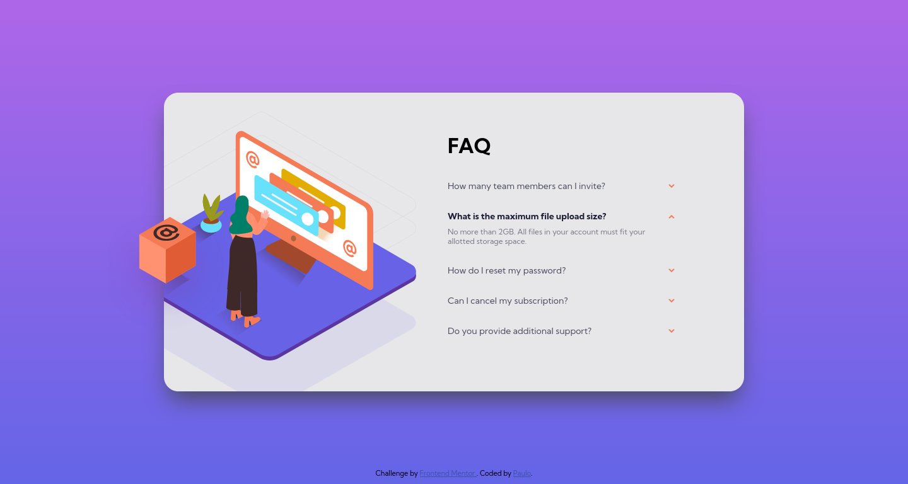
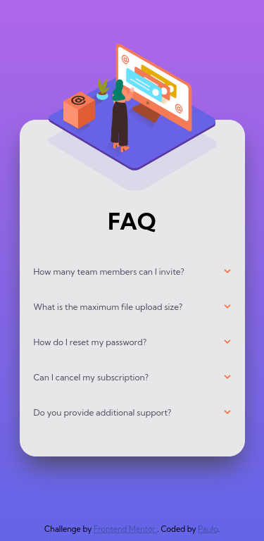

# Frontend Mentor - FAQ accordion card solution

This is a solution to the [FAQ accordion card challenge on Frontend Mentor](https://www.frontendmentor.io/challenges/faq-accordion-card-XlyjD0Oam). 

## Table of contents

- [Overview](#overview)
  - [The challenge](#the-challenge)
  - [Screenshots](#screenshots)
  - [Links](#links)
- [My process](#my-process)
  - [Built with](#built-with)
  - [What I learned](#what-i-learned)
  - [Useful resources](#useful-resources)
- [Author](#author)

## Overview

### The challenge

Users should be able to:

- View the optimal layout for the component depending on their device's screen size
- See hover states for all interactive elements on the page
- Hide/Show the answer to a question when the question is clicked

### Screenshot

### Links

- Solution URL: [Add solution URL here](https://your-solution-url.com)
- Live Site URL: [https://faq-accordion-card-wellspr.vercel.app](https://faq-accordion-card-wellspr.vercel.app)

## My process

### Built with

- Semantic HTML5 markup
- CSS
- Flexbox
- Mobile-first workflow

### What I learned

In this project I learned about the `details` and the `summary` tags. With these two tags It is possible to create a dropdown without using javascript.

Also, I found very instructive trying to align and position the background images.

### Useful resources

[https://www.w3schools.com/tags/tag_details.asp](https://www.w3schools.com/tags/tag_details.asp) - This is a tutorial on the details and summary tags. 
<!-- - [Example resource 1](https://www.example.com) - This helped me for XYZ reason. I really liked this pattern and will use it going forward.
- [Example resource 2](https://www.example.com) - This is an amazing article which helped me finally understand XYZ. I'd recommend it to anyone still learning this concept. -->

## Author

- Frontend Mentor - [@wellspr](https://www.frontendmentor.io/profile/wellspr)
- Twitter - [@paulo_wells](https://www.twitter.com/paulo_wells)
